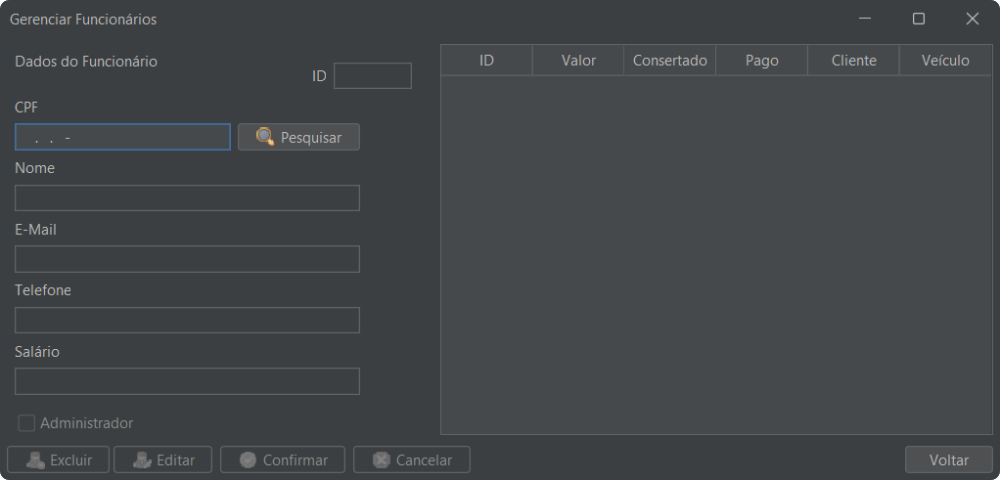

# Tonhão Autopeças

## Sumário
1. [Descrição do Projeto](#descrição-do-projeto)
    - [Motivação](#motivação)
2. [Regras de Negócio](#regras-de-negócio)
3. [Diagrama de Classes](#diagrama-de-classes)
   - [Classes do Sistema](#classes-do-sistema)
   - [Classes Auxiliares](#classes-auxiliares)
4. [Telas](#telas)
   - [Telas de Início](#telas-de-início)
   - [Telas de Cadastro e Criação](#telas-de-cadastro-e-criação)
   - [Telas de Gerenciamento](#telas-de-gerenciamento)

---

## Descrição do Projeto
Esse é o projeto final do grupo 8 do semestre 2024.2 da matéria Técnicas de Programação 1, ministrada em Java pela professora Roberta Barbosa Oliveira, da UnB (Universidade de Brasília).
O grupo é formado por:
- Henrique ([@Henrique-zoo](https://github.com/Henrique-zoo)) - Engenharia de Computação
- Nirva ([@NirvaCx](https://github.com/NirvaCx)) - Ciência da Computação
- Derick ([@derickandrade](https://github.com/derickandrade)) - Ciência da Computação

A parte relevante da estrutura do projeto foi organizada de acordo com a figura abaixo. É importante pontuar, porém, que alguns diretórios foram omitidos; esses são os criados e administrados pelo **NetBeans** ou utilizados para o versionamento pelo **git**.

```plaintext
Projeto-Final-TP1
└─── src
     ├── app
     │   ├── model # classes principais
     │   ├── ui    # telas
     │   └── utils # classes auxiliares
     └── resources
         └── images # imagens utilizadas
```

### Motivação

Oficinas mecânicas são essenciais para a manutenção da infraestrutura centrada em carros no Brasil. Infelizmente, são normalmente conhecidas por suas baixas confiabilidades e desorganização, especialmente quando estão afastadas de polos urbanos.

Visando uma solução moderna e simples para essas instituições, propomos um software de gerenciamento baseado em classes, com o objetivo de fornecer uma interface objetiva para gerenciar os seguintes elementos:

- Clientes
- Veículos
- Estoque de peças
- Ordens de serviço

O sistema atribui as ordens de serviço ao cliente, carro e funcionário, provendo status de conclusão e de pagamento, além de método de pagamento. Ele também gerencia o estoque ao solicitar novas peças e deduzir peças usadas em um serviço. O sistema automatiza a demanda de peças, verificando a disponibilidade no estoque e alocando-as automaticamente ao serviço solicitado.

## Regras de Negócio

- Clientes que pagarem em dinheiro ou Pix recebem 5% de desconto.
- A cada R$2.000,00 pagos, o cliente ganha um check-up completo do veículo e troca de óleo gratuitos.
- Funcionalidades de cadastrar, alterar e excluir objetos do programa requerem login de administrador.


## Diagrama de Classes

<div align="center">
    </br>
    <label>Figura 1: Diagrama de Classes do Projeto</label>
</div>

### Classes do Sistema

#### TipoDePeça
A classe **TipoDePeça** fornece uma abstração para definir os tipos de peças reconhecidos e catalogados pela oficina. Ela possui um sistema de atribuição de códigos a cada novo tipo de peça cadastrado e permite busca por código ou pelos outros atributos: tipo e marca. Além disso, cada tipo de peça possui seu respectivo preço no catálogo. Todos os tipos de peças instanciados no programa são adicionados a uma lista estática da classe. Isso permite que as outras classes de fato usem **TipoDePeça** da forma correta: nenhuma delas (fora a classe que implementa a tela de gerenciamento dos tipos de peça) instancia um novo tipo de peça: na verdade, elas utilizam referências a tipos de peça já existentes. Isso facilita inúmeras operações - ao invés de comparar se diversos atributos de uma peça são os mesmos de outra, por exemplo, podemos simplesmente verificar se é a mesma referência.

- **Atributos:**
    - `tPecasCadastradas` (static): Uma lista estática das peças conhecidas.
    - `idGenerator` (static): Um atributo utilizado pela própria classe que ajuda a fornecer o serviço de geração de código das peças.
    - `freeIds` (static): Uma lista que carrega códigos previamente utilizados, mas que foram liberados para uso futuro.
    - `id`: O código da peça.
    - `tipo`: O tipo da peça.
    - `marca`: A marca da peça.
    - `preco`: O preço da peça, um `double`.

- **Métodos:**
    - `TipoDePeca()`: O construtor. Também executa toda a lógica de atribuição de código e reordena a lista.
    - `removerCadastro()`: Remove o cadastro de um tipo de peça de acordo com uma referência ao objeto cadastrado.
    - `searchTPeca()`: Um método com sobrecarga que permite pesquisar um tipo de peça na lista de acordo com seu código, ou tipo e marca.
    - `getTPecaQuantity()`: Um getter especial que retorna a quantidade de peças cadastradas. Utilizado nas interfaces.
    - `searchTPecaPosition()`: Um método de busca especial, também utilizado nas interfaces, que fornece uma forma de buscar uma peça pelo seu índice na lista.

#### Peça
A classe **Peca** é uma classe muito simples, que "embrulha" duas informações: o **TipoDePeca**, e a quantidade. Ela fornece uma abstração para representar as peças físicas.

- **Atributos:**
    - `tipoPeca`: O tipo da peça.
    - `qtd`: A quantidade de peças.

- **Métodos:**
    - `Peca()`: O construtor padrão.
    - `Peca(TipoDePeca tipoPeca, int qtd)`: O construtor que inicializa os atributos.
    - `getTipoPeca()`: Retorna o tipo da peça.
    - `getQtd()`: Retorna a quantidade de peças.
    - `setQtd()`: Define a quantidade de peças.
    - `addQtd()`: Adiciona uma quantidade de peças.
    - `remQtd()`: Remove uma quantidade de peças.

#### Estoque
**Estoque** é uma classe abstrata pelo motivo de nunca ser instanciada (logo possui apenas membros estáticos), cuja função é autoexplicativa: é a representação do estoque da oficina.

- **Atributos:**
    - `estoque`: Uma lista de peças.

- **Métodos:**
    - `adicionarPeca()`: Um método que adiciona uma quantidade de uma peça ao estoque.
    - `removerPeca()`: Um método sobrecarregado que pode remover uma determinade quantidade de uma peça do estoque utilizando um TipoDePeca e uma quantidade ou uma referência a um objeto Peca.
    - `findPeca()`: Verifica se a peça está no estoque.
    - `getSize()`: Retorna quantos tipos diferentes de peça há no estoque.
    - `getPeca()`: Retorna a peça em um determinado índice da lista do estoque.

#### Veículo
A classe **Veiculo** modela os dados de um veículo. Uma lista dessas classes é um atributo da classe Cliente. Ela armazena as informações de id, ano, tipo, modelo, cor e placa, mas, principalmente, mantém uma lista de **pecasComProblema**, que é vazia até que o funcionário a popule pela tela de gerenciamento de serviços. A classe também oferece métodos para gerenciar os dados do veículo e manipular a lista de peças problemáticas, como adicionar peças com defeito e esvaziar a lista após os reparos. Essa estrutura permite uma organização eficiente dos diagnósticos e serviços realizados pela oficina.

- **Atributos:**
    - `id`: O código do veículo.
    - `ano`: O ano do veículo.
    - `tipo`: O tipo do veículo.
    - `modelo`: O modelo do veículo.
    - `cor`: A cor do veículo.
    - `placa`: A placa do veículo.
    - `pecasComProblema`: Uma lista de peças com defeito.

- **Métodos:**
    - `Veiculo()`: O construtor padrão.
    - `Veiculo(int ano, String tipo, String placa, String modelo, String cor)`: O construtor que inicializa os atributos.
    - `toString()`: Retorna a placa do veículo.
    - `esvaziarPecasComProblema()`: Esvazia a lista de peças com defeito.

#### Serviço
A classe **Serviços**, por sua vez, é essencial para o sistema. Nela, quase todas as outras classes do projeto são instanciadas para que se realize o que esse sistema se propõe a fazer: permitir que se tenha controle sobre um reparo de um funcionário ao veículo de um cliente.

- **Atributos:**
    - `id`: O código do serviço.
    - `valor`: O valor do serviço.
    - `pago`: Um booleano que indica se o serviço foi pago.
    - `consertado`: Um booleano que indica se o veículo foi consertado.
    - `metodoPagamento`: O método de pagamento.
    - `cliente`: O cliente que solicitou o serviço.
    - `veiculo`: O veículo que será consertado.
    - `funcionario`: O funcionário que realizará o serviço.

- **Métodos:**
    - `Servico()`: O construtor padrão.
    - `Servico(Cliente cliente, Veiculo veiculo, Funcionario funcionario)`: O construtor que inicializa os atributos.
    - `calculaValor()`: Calcula o valor do serviço, considera o método de pagamento para o devido desconto.
    - `adicionaPecasComProblema()`: Adiciona peças com defeito ao veículo.

#### Pessoa
A classe **Pessoa** é uma classe abstrata que fornece a estrutura básica para representar pessoas no sistema. Ela é a superclasse de **Cliente** e **Funcionario**, que serão explicados doravante.

- **Atributos:**
    - `id`: O código da pessoa.
    - `nome`: O nome da pessoa.
    - `cpf`: O CPF da pessoa.
    - `email`: O e-mail da pessoa.
    - `telefone`: O telefone da pessoa.

- **Métodos:**
    - `Pessoa()`: O construtor default.
    - `Pessoa(int id, String nome, String cpf, String email, String telefone)`: O construtor que inicializa os atributos com id informado.
    - `Pessoa(String nome, String cpf, String email, String telefone)`: O construtor que inicializa os atributos.

#### Cliente
A classe **Cliente**, que herda a classe **Pessoa**, oferece a estrutura para armazenar os dados de um cliente no contexto de uma oficina mecânica. Ela mantém informações como nome, telefone, endereço e uma lista de veículos associados ao cliente. Os objetos dessa classe são utilizados para criar os serviços da oficina.

- **Atributos:**
    - `debito`: O débito do cliente.
    - `totalPago`: O total pago pelo cliente.
    - `idGenerator`: atributo utilizado para criar o id do cliente quando ele é criado.
    - `idsLivres`: Uma lista dos ids livres para serem reutilizados.
    - `veiculos`: Uma lista de veículos associados ao cliente.

- **Métodos:**
    - `Cliente()`: O construtor default.
    - `Cliente(String nome, String cpf, String email, String telefone)`: O construtor que inicializa os atributos.
    - `addIdLivre(int id)`: adiciona o ID do cliente excluído à lista de ID's livres.
    - `getVeiculoById(int i)`: retorna o veículo a partir do ID fornecido.
    - `excluirVeiculo(Veiculo veiculo)`: Exclui um veículo da lista de veículos.
    - `excluirVeiculos()`: Exclui todos os veículos da lista de veículos.

#### Funcionário
A classe **Funcionario**, que herda a classe **Pessoa**, implementa uma estrutura para simular um funcionário no sistema da oficina. Ela fornece os métodos necessários para gerenciar os serviços e peças.

- **Atributos:**
    - `salario`: O salário do funcionário.
    - `servicosFeitos`: A quantidade de serviços feitos pelo funcionário.
    - `admin`: Um booleano que indica se o funcionário é administrador.
    - `senha`: A senha do funcionário, utilizada para acessar o sistema.
    - `servicosAtivos`: Um HashMap de serviços ativos, que mapeia o id do serviço ao serviço.
    - `idsLivres`: Uma **priority queue** dos ids livres para serem reutilizados.
    - `idGenerator`: Um atributo utilizado para criar o id do funcionário quando ele é criado.

- **Métodos:**
    - `Funcionario()`: O construtor default.
    - `Funcionario(double salario, String senha, int id, String nome, String cpf, String email, String telefone)`: O construtor que inicializa os atributos com id informado.
    - `Funcionario(double salario, String senha, String nome, String cpf, String email, String telefone)`: O construtor que inicializa os atributos.
    - `Funcionario(String senha, String nome, String cpf, String email, String telefone)`: O construtor que inicializa os atributos sem salário informado.
    - `completaServico(Servico servico)`: Completa um serviço.
    - `pegarPecasNoEstoque(Servico servico)`: Gerencia as peças necessárias para um serviço, identificando as peças faltantes no estoque e removendo as peças disponíveis.
    - `consertarVeiculo(Servico servico, String metodo)`: Calcula o valor de um serviço, esvazia a lista de peças com problema do veículo associado e define o serviço como consertado.
    - `addIdLivre(int id)`: adiciona o ID do cliente excluído à lista de ID's livres.

### Classes Auxiliares

#### Sessão de Usuário
A classe **SessaoUsuario** é uma classe auxiliar que fornece ao sistema uma lógica de sessão do usuário autenticado no momento. Ela mantém uma referência estática ao funcionário logado, que é criada quando o usuário faz a autenticação pela tela de Login.

- **Atributos:**
    - `instancia`: Inicializa a única instância do usuário logado.
    - `usuarioLogado`: O funcionário logado.

- **Métodos:**
    - `SessaoUsuario()`: O construtor **privado**, para impedir a criação de múltiplas instâncias.
    - `getInstancia()`: Retorna a instância do usuário logado.
    - `setUsuarioLogado(Funcionario usuarioLogado)`: Define o funcionário logado.
    - `getUsuarioLogado()`: Retorna o funcionário logado.

**Implementação da classe SessaoUsuario:**

```java
package app.utils;

import app.model.Funcionario;

public class SessaoUsuario {
    private static SessaoUsuario instancia;
    private Funcionario usuarioLogado;

    private SessaoUsuario() {}

    public static SessaoUsuario getInstancia() {
        if (instancia == null) {
            instancia = new SessaoUsuario();
        }
        return instancia;
    }

    public void setUsuarioLogado(Funcionario usuario) {
        this.usuarioLogado = usuario;
    }

    public Funcionario getUsuarioLogado() {
        return usuarioLogado;
    }
}
```

#### idGenerator
Essa classe foi utilizada por algumas classes para gerar códigos únicos para os objetos. Ela fornece um método estático que retorna um código único para cada objeto criado. O código é gerado a partir de um contador que é incrementado a cada chamada do método.

- **Atributos:**
    - `currentServicoId`: O contador dos ids de serviços.
    - `currentVeiculoId`: O contador dos ids de veículos.

- **Métodos:**
    - `generateServicoID()`: Gera um id único para um serviço.
    - `generateVeiculoID()`: Gera um id único para um veículo.

Ambos **synchronized**, isto é, que podem ser acessados apenas por uma thread por vez, para evitar problemas de concorrência.

#### Objetos
A classe **Objetos** é uma classe auxiliar que mantém **HashMap**s públicos e estáticos de todas as classes do sistema, armazenando os objetos criados de cada classe na interface de forma a simular o funcionamento real de um sistema com persistência durante a execução do programa. Além disso, nessa classe são criados, na execução do programa, os objetos padrão de cada classe, de forma a facilitar a visualização e o teste do sistema.

- **Atributos:**
    - `clientes`: Um **HashMap** de clientes.
    - `funcionarios`: Um **HashMap** de funcionários.
    - `veiculos`: Um **HashMap** de veículos.
    - `servicos`: Um **HashMap** de serviços.
    - `placas`: Uma **ArrayList** de placas de veículos.

- **Métodos:**
    - Métodos para criar objetos de exemplo no sistema.

## Telas

### Telas de Início

#### Tela de Login
É a tela inicial do sistema. A partir dela, é realizada a autenticação do usuário. Caso o usuário não tenha uma conta, ele pode clicar em "Clique aqui" e criar uma.

<div align="center" style="width: 50%; margin: 0 auto;">
    <br>
    <label> Figura 2: Tela de login </label>
</div>

#### Tela de Início
A primeira tela acessada após a realização da autenticação. A partir dela, podemos selecionar qual classe se deseja mexer. Pode-se também encerrar a sessão de usuário ao clicar em `Sair`.

<div align="center" style="width: 50%; margin: 0 auto;">
    <br>
    <label> Figura 3: Tela Inicial </label>
</div>

#### Seção de Clientes
Possui uma tabela com as informações básicas de todos os clientes cadastrados, bem como um botão para redirecionar para o cadastro de clientes e outro para o gerenciamento
de clientes.

<div align="center" style="width: 50%; margin: 0 auto;">
    <br>
    <label> Figura 4: Tela inicial - Seção de clientes </label>
</div>

#### Seção de Funcionários
Segue o padrão da tela anterior, uma tabela com informações básicas de funcionários, um botão para cadastro e outro para gerenciamento.

<div align="center" style="width: 50%; margin: 0 auto;">
    <br>
    <label> Figura 5: Tela inicial - Seção de funcionários</label>
</div>

#### Seção de Peças
Conta com a lista de peças no estoque e respectivas informações, além dos botões para acessar a área de cadastro de peças e gerenciar o estoque.

<div align="center" style="width: 50%; margin: 0 auto;">
    <br>
    <label> Figura 6: Tela inicial - Seção de peças</label>
</div>

#### Seção de Serviços
Segue o mesmo padrão da interface anterior. Contém uma tabela que informa os serviços e suas respectivas informações, e os botões para criar um novo serviço e gerenciar os serviços existentes.

<div align="center" style="width: 50%; margin: 0 auto;">
    <br>
    <label> Figura 7: Tela inicial - Seção de serviços</label>
</div>

### Telas de Cadastro e Criação

#### Cadastro de Clientes
Nessa tela, podemos cadastrar um novo cliente a partir das informações iniciais necessárias. O cadastro conta com verificação e tratamento de exceção, caso algum campo não seja devidamente preenchido, e verificação de CPF já cadastrado. Além de contar com um botão para retornar à tela principal.

<div align="center" style="width: 50%; margin: 0 auto;">
    <br>
    <label> Figura 8: Tela de Cadastro - Clientes</label>
</div>

#### Cadastro de Funcionários
Nessa interface, realiza-se o cadastro de funcionários, em que o salário é opcional de ser informado. Conta com tratamento de exceção para campos vazios, CPF já cadastrado e senhas que não coincidem. Conta também com o botão de retorno à página principal.

<div align="center" style="width: 50%; margin: 0 auto;">
    <br>
    <label> Figura 9: Tela de Cadastro - Funcionários</label>
</div>

#### Criação de Veículos
Por meio dessa tela, podemos gerenciar clientes e criar veículos. Note que o veículo só é criado vinculado a um cliente; ele só existe como atributo do cliente e de serviços. Até por isso, não foi feita uma tela própria para a criação de veículos.

<div align="center" style="width: 50%; margin: 0 auto;">
    <br>
    <label> Figura 10: Tela de Criação de Veículos</label>
</div>

#### Criação de Serviços
Nessa tela, podemos criar um serviço. O serviço, inicialmente, é apenas uma associação entre um cliente, um funcionário e um veículo do cliente. Para incrementar os objetos dessa classe, deve-se utilizar a tela de gerenciamento de serviços.

<div align="center" style="width: 50%; margin: 0 auto;">
    <br>
    <label> Figura 11: Tela de Criação de Serviços</label>
</div>

### Telas de Gerenciamento

#### Gerenciamento de Clientes
A partir dessa tela, podemos alterar os dados de um cliente, excluir um cliente e adicionar veículos ao cliente. Além de verificar, em uma tabela, os dados de todos os clientes cadastrados no sistema.

<div align="center" style="width: 50%; margin: 0 auto;">
    <br>
    <label> Figura 12: Tela de gerência de clientes</label>
</div>

#### Gerenciamento de Funcionários
Por essa tela, podemos alterar os dados de funcionários. Um administrador pode alterar os dados de qualquer funcionário. Um funcionário pode alterar seus próprios dados cadastrais, com exceção do seu status de administrador, que apenas pode ser manipulado por outros administradores.

<div align="center" style="width: 50%; margin: 0 auto;">
    <br>
    <label> Figura 13: Tela de gerência de funcionários</label>
</div>

#### Gerenciamento de Estoque
Por essa interface, podemos gerenciar o estoque, o que se resume em manipular peças, isto é, adicioná-las, removê-las e pesquisá-las por tipo, marca e código.

<div align="center" style="width: 50%; margin: 0 auto;">
    <br>
    <label> Figura 14: Tela de gerência do estoque</label>
</div>

#### Gerenciamento de Serviços
Por intermédio dessa tela, o funcionário controla o serviço, podendo informar as peças com problemas e o status atual do serviço - se o carro já foi consertado, o serviço já foi pago, etc.

<div align="center" style="width: 50%; margin: 0 auto;">
    <br>
    <label> Figura 15: Tela de gerência de serviços</label>
</div>